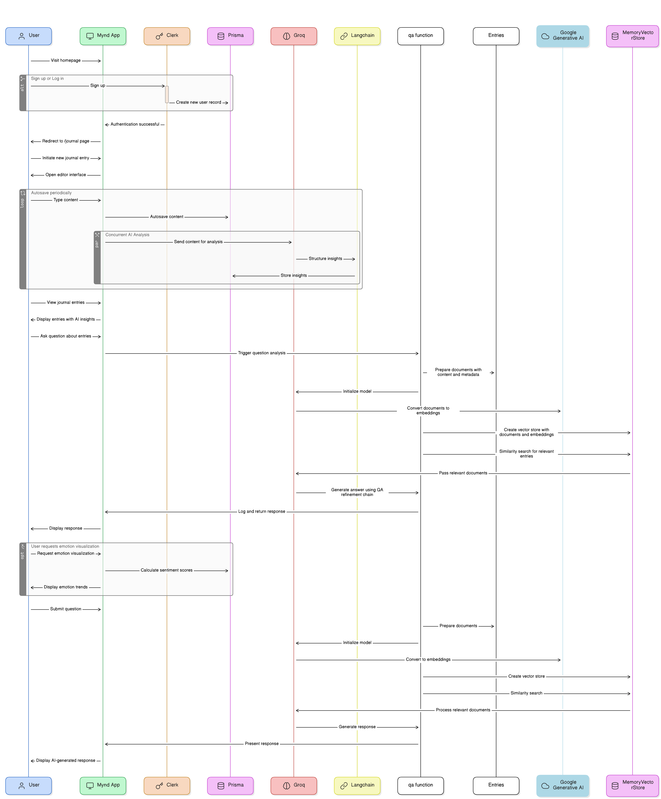

# **Mynd: AI-powered journaling. Track your mood, understand your emotions, and grow✨**

**Mynd** is an AI-powered journaling app that analyzes your entries to provide unique, data-driven insights into your emotional state. By pinpointing your mood, sentiments, and emotions at the time of writing, **Mynd** helps you track your emotional journey over time with mood tracking charts and visualizations. Identify patterns in your feelings and discover what triggers different emotions, enhancing your self-understanding and personal growth.

## Table of Contents

- [Features](#features)
- [Installation](#installation)
- [Architecture](#architecture)
- [Tech Stack](#tech-stack)
- [Contributing](#contributing)

## Features

1. **AI-Powered Emotional Analysis:** **Mynd** employs Groq AI to delve into your journal entries, uncovering emotions and sentiments, providing insightful data on your mood at the moment of writing.
2. **Visualise Emotional Trends:** With Langchain, track and visualise your emotional journey over time, spotting patterns and triggers for various emotions through interactive charts.
3. **Personalised Growth Insights:** Receive tailored recommendations for well-being based on AI-analyzed emotional patterns, guiding you towards balanced living.
4. **Secure & Confidential:** Clerk ensures secure login, while end-to-end encryption safeguards your journal entries, maintaining privacy.
5. **Responsive Design Across Devices:** Crafted with Next.js and TypeScript, enjoy a seamless experience on any device, enhanced by Vector Database for smart semantic searches.

## Installation

1. **Clone the Repository:**

   ```sh
   git clone https://github.com/devansh1401/Mynd
   cd Mynd
   ```

2. **Install Dependencies:**

   ```sh
   npm install
   # or
   yarn install
   ```

3. **Database Setup:**

   - **Prisma:** The project uses Prisma as the ORM. You'll need to have a database compatible with Prisma (e.g., PostgreSQL, MySQL, SQLite). Preferably, use [Planetscale](https://planetscale.com/) or [NeonDB](https://neon.tech/).

4. **Environment Variables:**

   - Fill in the `.env` file with your actual configuration details, including:
     - Database connection URL (`DATABASE_URL` for Prisma).
     - Clerk API keys (`NEXT_PUBLIC_CLERK_PUBLISHABLE_KEY`, `CLERK_SECRET_KEY` for Clerk authentication).
     - Groq API key (`GROQ_API_KEY` for AI analysis).
     - Google API key (`GOOGLE_API_KEY` for Google Generative AI Embeddings).

5. **Clerk Configuration:**

   - Sign up for [Clerk](https://clerk.com/) and create a new application to get your Clerk keys.
   - Configure Clerk in your `.env` file with the keys obtained.

6. **External Services:**

   - Groq: Obtain an API key for Groq and set it in your `.env` file. You can get your Groq API key [here](https://wow.groq.com/).
   - Google Generative AI Embeddings: Ensure you have access and set the API key in `.env`. For Gemini API key, refer to [this YouTube video](https://youtu.be/a_vuUufkCy4?si=EvX9I9eoUBDnf3df).

7. **Run the Development Server:**

   ```sh
   npm run dev
   # or
   yarn dev
   ```

8. **The application will open in your default web browser. If not, you can access it by navigating to the URL provided in the terminal output.**

### Optional Dependencies

- If the project uses other external services or APIs, ensure you have the necessary keys and configurations set in `.env`.

### Note

This setup assumes you have basic knowledge of the workflow of Next.js, npm/yarn, and database management. Adjustments may be needed based on your specific development environment and the external services you're using.

## Architecture

The Mynd project architecture involves multiple components and services, as depicted in the following diagram:



## Tech Stack

The Mynd project utilizes a streamlined set of technologies to deliver an AI-powered journaling experience:

### Frontend

- [Next.js](https://nextjs.org/): Server-rendered React applications.
- [React](https://reactjs.org/): UI library for building user interfaces.
- [Tailwind CSS](https://tailwindcss.com/): Utility-first CSS framework for styling.
- [React Autosave](https://www.npmjs.com/package/react-autosave): Automatic form data saving.

### Backend

- [Prisma](https://www.prisma.io/): Database toolkit for easy data management.
- [Clerk](https://clerk.com/): User authentication and management.

### AI and Analysis

- [Langchain](https://www.langchain.com/) & [Groq](https://wow.groq.com/): AI analysis of text for insights.
- [Google Generative AI Embeddings](https://cloud.google.com/): Semantic understanding of text.
- [Zod](https://zod.dev/): Validation for structured outputs.

### Database and Deployment

- [Prisma Client](https://www.prisma.io/docs/concepts/components/prisma-client): ORM for database access.
- [Vercel](https://vercel.com/): Deploying Next.js applications.

### Authentication

- [Clerk](https://clerk.com/): Secure user authentication.

### External APIs

- [Groq](https://wow.groq.com/): AI service for text analysis.
- [Google Generative AI Embeddings](https://cloud.google.com/): Enhances AI analysis.

## Contributing

**Mynd** values contributions from the community! We welcome bug reports, feature suggestions, code improvements, assistance with testing new features, and help in maintaining up-to-date documentation. To contribute, simply fork the repository, create an issue for bug reports or feature suggestions, submit pull requests for code improvements, or provide feedback through testing and documentation edits. Thank you for helping us make **Mynd** even better!
